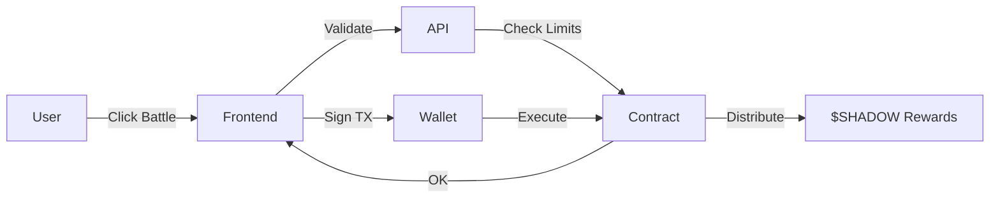
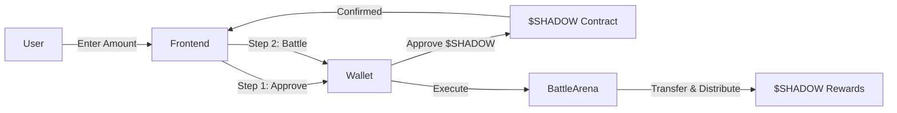

# On-Chain Battle System Implementation Guide

## 🎯 Overview

FrameFusion Genesis now features a **fully on-chain battle system** with **role-based treasury management** for maximum security and transparency.

## 🔐 Security Architecture

### **Problem: Private Keys Are Dangerous**

```
❌ Traditional Approach:
┌─────────────┐
│   Backend   │  Stores private key
│             │  ↓
│   Wallet    │  Can withdraw ALL funds
│             │  Can transfer treasury
│   💀 RISK   │  Single point of failure
└─────────────┘
```

### **Solution: Role-Based Access Control**

```
✅ New Approach:
┌───────────────┐
│  Backend      │  Has BATTLE_OPERATOR_ROLE
│               │  ↓
│  Can Execute  │  ✓ Execute battles
│  Battles ONLY │  ✓ Read contract state
│               │  ✗ Cannot withdraw
│  ✓ SECURE     │  ✗ Cannot change config
└───────────────┘
```

## 📋 Implementation Steps

### Step 1: Deploy Contracts

#### 1.1 Deploy $SHADOW Token (if not deployed)

```bash
forge create src/contracts/ShadowToken.sol:ShadowToken \
  --rpc-url $BASE_RPC_URL \
  --private-key $DEPLOYER_PRIVATE_KEY \
  --verify

# Save address
export SHADOW_TOKEN_ADDRESS=<deployed_address>
```

#### 1.2 Deploy BattleArena

```bash
# Parameters needed:
# 1. $SHADOW token address
# 2. FrameShadows NFT: 0xC53B19ea5EE1fa5dFCe12CdAD71813bee27f4B31
# 3. WeaponNFT: 0xEE24F39b5C8a444e46F26Dc858D61374cb7c9b1c
# 4. Treasury wallet address
# 5. Raffle pool wallet address

forge create src/contracts/BattleArena.sol:BattleArena \
  --rpc-url $BASE_RPC_URL \
  --private-key $DEPLOYER_PRIVATE_KEY \
  --constructor-args \
    $SHADOW_TOKEN_ADDRESS \
    0xC53B19ea5EE1fa5dFCe12CdAD71813bee27f4B31 \
    0xEE24F39b5C8a444e46F26Dc858D61374cb7c9b1c \
    $TREASURY_WALLET \
    $RAFFLE_WALLET \
  --verify

export BATTLE_ARENA_ADDRESS=<deployed_address>
```

### Step 2: Setup Roles

#### 2.1 Grant Backend Operator Role

Create a **separate backend service wallet**:
```bash
# Generate new wallet for backend
cast wallet new

# Save the private key and address
export BACKEND_SERVICE_ADDRESS=<new_address>
export BACKEND_SERVICE_PRIVATE_KEY=<new_private_key>

# Fund it with small ETH for gas (~0.01 ETH)
cast send $BACKEND_SERVICE_ADDRESS \
  --value 0.01ether \
  --rpc-url $BASE_RPC_URL \
  --private-key $DEPLOYER_PRIVATE_KEY
```

Grant BATTLE_OPERATOR_ROLE:
```bash
cast send $BATTLE_ARENA_ADDRESS \
  "grantRole(bytes32,address)" \
  $(cast keccak "BATTLE_OPERATOR_ROLE") \
  $BACKEND_SERVICE_ADDRESS \
  --rpc-url $BASE_RPC_URL \
  --private-key $DEPLOYER_PRIVATE_KEY
```

#### 2.2 Setup Multisig for Admin (Recommended)

For production, use Gnosis Safe:
1. Create Safe with 3-of-5 signatures
2. Transfer DEFAULT_ADMIN_ROLE to Safe
3. Transfer TREASURY_MANAGER_ROLE to Safe

```bash
# Transfer admin role to multisig
cast send $BATTLE_ARENA_ADDRESS \
  "grantRole(bytes32,address)" \
  0x0000000000000000000000000000000000000000000000000000000000000000 \
  $GNOSIS_SAFE_ADDRESS \
  --rpc-url $BASE_RPC_URL \
  --private-key $DEPLOYER_PRIVATE_KEY

# Revoke from original deployer
cast send $BATTLE_ARENA_ADDRESS \
  "revokeRole(bytes32,address)" \
  0x0000000000000000000000000000000000000000000000000000000000000000 \
  $DEPLOYER_ADDRESS \
  --rpc-url $BASE_RPC_URL \
  --private-key $DEPLOYER_PRIVATE_KEY
```

### Step 3: Update Environment Variables

Add to your `.env.local`:

```bash
# BattleArena Contract
NEXT_PUBLIC_BATTLE_ARENA_ADDRESS=<deployed_address>
NEXT_PUBLIC_SHADOW_TOKEN_ADDRESS=<deployed_address>

# Backend Service Account (BATTLE_OPERATOR_ROLE only)
BATTLE_OPERATOR_PRIVATE_KEY=<backend_service_private_key>

# Note: This key can ONLY execute battles, cannot withdraw funds
```

### Step 4: Update Frontend Config

Update `src/lib/battle-arena-contract.ts`:

```typescript
export const BATTLE_ARENA_CONTRACT = {
  address: process.env.NEXT_PUBLIC_BATTLE_ARENA_ADDRESS!, // Update from .env
  abi: [ /* ... */ ],
} as const;
```

Update `src/lib/shadow-contract.ts`:

```typescript
export const SHADOW_TOKEN_CONTRACT = {
  address: process.env.NEXT_PUBLIC_SHADOW_TOKEN_ADDRESS!, // Update from .env
  abi: [ /* ... */ ],
} as const;
```

### Step 5: Integrate UI

Replace old battle component with on-chain version:

```tsx
// src/app/page.tsx or wherever battles are displayed

import { BattleArenaOnChain } from '@/components/battle-arena-onchain';

// Instead of:
// <BattleArena fid={fid} framefusionClass={class} />

// Use:
<BattleArenaOnChain 
  fid={fid} 
  framefusionClass={class} 
  monsterElement={element} 
/>
```

## 🚀 User Flow

### Free Tier (No Approval Needed)



### Paid Tier (Requires Approval)



## 🔍 How It Works

### 1. **User Initiates Battle**

Frontend collects:
- Monster to battle
- Entry tier (free/standard/premium)
- Entry amount (if paid)

### 2. **Backend Validates** (API: `/api/battle/onchain`)

Checks on-chain:
- ✓ Daily limit not exceeded
- ✓ Sufficient $SHADOW balance
- ✓ $SHADOW allowance approved
- ✓ Monster ownership valid
- ✓ Entry amount in tier range

Returns:
```json
{
  "success": true,
  "remainingBattles": 2,
  "message": "Ready to battle!"
}
```

### 3. **User Approves $SHADOW** (Paid Tiers Only)

```typescript
// Frontend calls
await shadowContract.write.approve([
  BATTLE_ARENA_ADDRESS,
  entryAmount
]);
```

### 4. **User Signs Battle Transaction**

```typescript
// Frontend calls
await battleArenaContract.write.executeBattle([
  monsterTokenId,
  frameFusionClassEnum,
  monsterElementEnum,
  entryFee,
  weaponTokenId || 0
]);
```

### 5. **Smart Contract Executes**

BattleArena.sol:
1. Validates all parameters
2. Checks daily limit on-chain
3. Transfers entry fee from user
4. Calculates multipliers:
   - Power (based on monster rarity)
   - Element (class vs element advantage)
   - Weapon (if equipped)
5. Distributes rewards:
   - 50% base to winner (with multipliers)
   - 25% to monster owner
   - 15% to treasury
   - 10% to raffle pool
6. Emits events
7. Records battle

### 6. **Backend Records in Database** (Optional)

For caching and analytics:
```typescript
await fetch('/api/battle/onchain', {
  method: 'POST',
  body: JSON.stringify({
    action: 'record',
    txHash,
    battleId
  })
});
```

## 📊 Contract State Diagram

```
BattleArena Contract State:
┌─────────────────────────────────┐
│                                 │
│  User Data:                     │
│  ├─ dailyBattleCount[address]   │
│  ├─ lastBattleDate[address]     │
│  └─ MAX_DAILY_BATTLES = 3       │
│                                 │
│  Battle History:                │
│  └─ battles[battleId]           │
│      ├─ participants            │
│      ├─ rewards                 │
│      ├─ multipliers             │
│      └─ timestamp               │
│                                 │
│  Contracts:                     │
│  ├─ shadowToken                 │
│  ├─ frameShadowsNFT             │
│  └─ weaponNFT                   │
│                                 │
│  Treasury:                      │
│  ├─ treasuryWallet              │
│  └─ rafflePoolWallet            │
│                                 │
└─────────────────────────────────┘
```

## 🛡️ Security Features

### 1. **Role-Based Access**

| Role | Permissions | Risk Level |
|------|-------------|------------|
| **DEFAULT_ADMIN** | Emergency pause, grant/revoke roles | 🔴 High (use multisig) |
| **TREASURY_MANAGER** | Update treasury/raffle wallets | 🟡 Medium |
| **BATTLE_OPERATOR** | Execute battles only | 🟢 Low |

### 2. **Reentrancy Protection**

```solidity
function executeBattle(...) 
    external 
    nonReentrant  // ✓ Prevents reentrancy attacks
    whenNotPaused // ✓ Can be emergency stopped
{ ... }
```

### 3. **Daily Limits**

Enforced on-chain:
```solidity
function _checkDailyLimit(address user) internal {
    uint256 today = block.timestamp / 1 days;
    if (today > lastDay) {
        dailyBattleCount[user] = 0; // Reset
    }
    require(dailyBattleCount[user] < 3, "Limit reached");
    dailyBattleCount[user]++;
}
```

### 4. **Pausable**

Admin can pause in emergency:
```bash
cast send $BATTLE_ARENA_ADDRESS "pause()" \
  --rpc-url $BASE_RPC_URL \
  --private-key $ADMIN_KEY
```

### 5. **Event Logging**

All actions logged on-chain:
```solidity
event BattleExecuted(
    bytes32 indexed battleId,
    address indexed frameFusionOwner,
    address indexed monsterOwner,
    uint256 entryFee,
    uint256 frameFusionReward
);
```

## 🧪 Testing

### Local Testing (Hardhat/Foundry)

```bash
# Test battle execution
forge test --match-test testExecuteBattle -vvv

# Test role permissions
forge test --match-test testRolePermissions -vvv

# Test daily limits
forge test --match-test testDailyLimit -vvv

# Test reward calculations
forge test --match-test testRewardCalculations -vvv
```

### Testnet Testing (Base Sepolia)

1. Deploy to Base Sepolia
2. Mint test $SHADOW to test accounts
3. Execute battles with various tiers
4. Verify events on BaseScan
5. Check reward distributions

### Mainnet Checklist

- [ ] All tests passing
- [ ] Testnet battle tested
- [ ] Role permissions verified
- [ ] Multisig setup for admin
- [ ] Emergency pause tested
- [ ] Gas costs optimized
- [ ] Event monitoring setup
- [ ] User documentation ready

## 📈 Monitoring & Analytics

### Watch Battle Events

```typescript
// Listen for new battles
const filter = await battleArenaContract.createEventFilter.BattleExecuted();
const events = await publicClient.getFilterLogs({ filter });

for (const event of events) {
  console.log({
    battleId: event.args.battleId,
    winner: event.args.frameFusionOwner,
    reward: event.args.frameFusionReward
  });
}
```

### Query On-Chain Data

```bash
# Total battles
cast call $BATTLE_ARENA_ADDRESS "totalBattles()" --rpc-url $BASE_RPC_URL

# User's remaining battles
cast call $BATTLE_ARENA_ADDRESS \
  "getRemainingBattles(address)" \
  $USER_ADDRESS \
  --rpc-url $BASE_RPC_URL

# Get battle details
cast call $BATTLE_ARENA_ADDRESS \
  "getBattle(bytes32)" \
  $BATTLE_ID \
  --rpc-url $BASE_RPC_URL
```

### Analytics Dashboard

Track:
- Total battles per day
- Average entry fees
- Reward distribution
- Most popular tiers
- Weapon usage stats
- Class advantage frequencies

## 🚀 Benefits vs Off-Chain

| Feature | Off-Chain | On-Chain |
|---------|-----------|----------|
| **Transparency** | ❌ Hidden in database | ✅ Public blockchain |
| **Trust** | ❌ Trust operators | ✅ Trust code |
| **Verifiability** | ❌ No public proof | ✅ Anyone can verify |
| **Security** | ❌ DB can be hacked | ✅ Immutable |
| **Composability** | ❌ Isolated | ✅ Other contracts can use |
| **Auditable** | ❌ Internal only | ✅ Public events |

## 💡 Future Enhancements

1. **Tournament Contracts**: Players can create tournaments
2. **Betting System**: Spectators bet on battles
3. **Battle Replay**: Store compressed battle data on-chain
4. **NFT Prizes**: Distribute NFTs to top battlers
5. **Cross-Chain**: Bridge to other L2s
6. **DAO Governance**: Community votes on multipliers

## 🔧 Troubleshooting

### "Daily limit reached"
- Wait 24 hours or check remaining battles on-chain
- Limit resets at midnight UTC

### "Insufficient SHADOW balance"
- Check balance: `cast call $SHADOW_TOKEN "balanceOf(address)" $USER`
- Mint more or earn from battles

### "Need to approve SHADOW"
- User must approve $SHADOW spending first
- Frontend shows approval button

### "Cannot battle your own monster"
- Users cannot battle monsters they own
- Select different monster

### "Transaction failed"
- Check gas price
- Verify contract not paused
- Check user has sufficient ETH for gas

## 📝 Summary

**What Changed:**
- ✅ Battles now verified on-chain
- ✅ Rewards distributed via smart contract
- ✅ Role-based access (no backend private keys)
- ✅ Transparent and auditable
- ✅ Users sign their own transactions

**What Stayed:**
- ✓ Same battle mechanics
- ✓ Same class advantages
- ✓ Same entry tiers
- ✓ Same reward calculations
- ✓ Database for caching (optional)

**Security Improvements:**
- 🔐 Backend cannot drain funds
- 🔐 Multi-role access control
- 🔐 Emergency pause capability
- 🔐 On-chain daily limits
- 🔐 Public event logging

---

**Ready to battle on-chain? Deploy the contracts and let players verify every reward! ⚔️🛡️**
